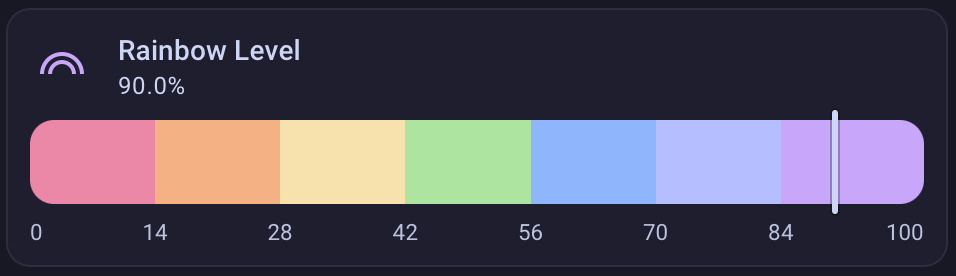
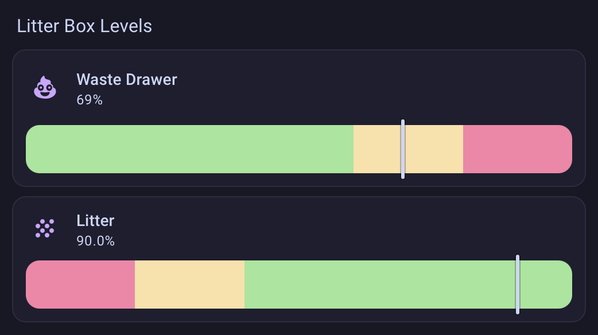
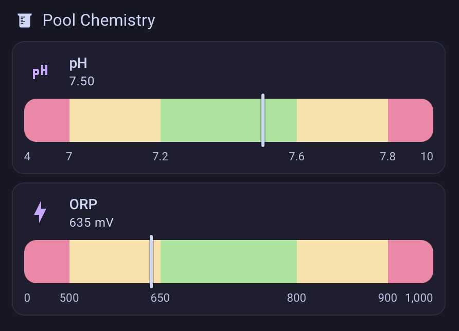

# Linear Gauge Home Assistant Card Feature



A Home Assistant custom [card feature](https://developers.home-assistant.io/docs/frontend/custom-ui/custom-card-feature/)
that renders a sensor entity as a value on a horizontal, multi-colored region bar with a marker for the current value.

## Install

1. Copy `linear-gauge-card-feature.js` into your HA config under `config/www/`
   (e.g. `config/www/linear-gauge-card-feature.js`).
2. Add it as a Lovelace resource:
   - **Settings → Dashboards → ⋮ → Resources → Add Resource**
   - URL: `/local/linear-gauge-card-feature.js`
   - Type: **JavaScript Module**
3. Refresh your browser (hard reload to clear the cache).
4. Add it to the `features:` list of any card that supports features (e.g. the Tile card).

## Examples

### Litter Box



```yaml
type: tile
entity: sensor.litter_robot_4_waste_drawer
name: Waste Drawer
icon: mdi:emoticon-poop
features:
  - type: custom:linear-gauge
    segments:
      - { from: 0, color: green }
      - { from: 60, color: yellow }
      - { from: 80, color: red }
```

### Pool Chemistry



```yaml
type: tile
entity: sensor.pool_ph
name: pH Level
icon: mdi:ph
features:
  - type: custom:linear-gauge
    min: 4
    max: 10
    weighted: true
    boundary_labels: true
    segments:
      - { from: 4, color: "red", weight: 1 }
      - { from: 7.0, color: "yellow", weight: 2 }
      - { from: 7.2, color: "green", weight: 3 }
      - { from: 7.6, color: "yellow", weight: 2 }
      - { from: 7.8, color: "red", weight: 1 }
```

## Configuration

The card feature can be configured from the dashboard's visual editor or in YAML.

| Option              | Type    | Default     | Description                                                              |
| ------------------- | ------- | ----------- | ------------------------------------------------------------------------ |
| `min`               | number  | `0`         | Minimum value (left edge of the bar).                                    |
| `max`               | number  | `100`       | Maximum value (right edge of the bar).                                   |
| `weighted`          | boolean | `false`     | Set to `true` to use proportional widths based on each segment's `weight`|
| `boundary_labels`   | boolean | `false`     | Show the boundary value labels under the bar.                            |
| `segments`          | list    | _optional_  | Colored regions tiling the bar. Omit for a single bar in the card's feature color. |
| `segments[].from`   | number  | required    | Value at which the segment's color begins. The first should equal `min`. |
| `segments[].color`  | string  | required    | HA theme color name or CSS color.                                        |
| `segments[].weight` | number  | `1`         | Relative width when `weighted: true`; ignored otherwise.                 |
